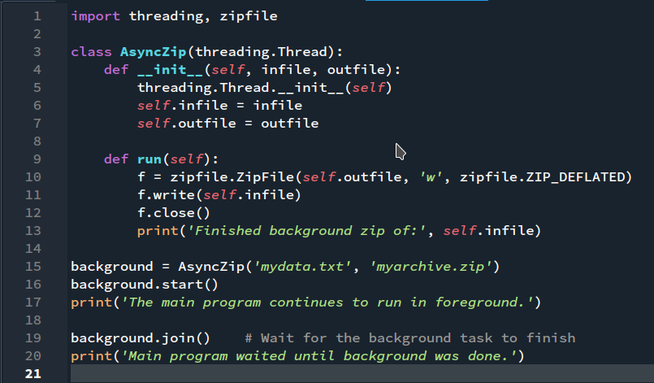
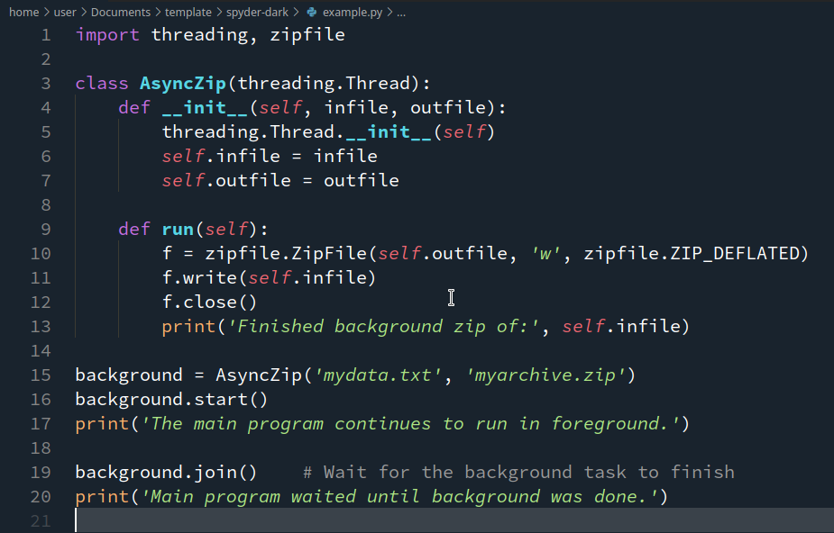

# spyder-dark README
This Theme implements the classic Spyder IDE Dark Theme for visual studio code's editor using Textmate Grammer scopes. This theme was built with Python in mind, so it's recommended to pick up the *Theme by language* extension by jsaulou and set this theme to be active only for .py files.

## A Quick Comparison
Here is a quick snippet of code (from the [Python Docs](https://docs.python.org/3/tutorial/stdlib2.html#multi-threading)
).

In Spyder it might look something like this, depending on your settings:

In VSCode it looks very similar!

## More information

Spyder and VSCode differ in a couple other ways which you may wish to tinker with: 
- [Bracket Pair Colorization](https://code.visualstudio.com/blogs/2021/09/29/bracket-pair-colorization) is applied after theming. Can be disabled if desired in settings with `"editor.bracketPairColorization.enabled": false`.
- Font. Spyder uses *Source Code Pro* as it's code font, which can be applied in settings with `"editor.fontFamily": "'Source Code Pro', 'Source Code Pro', monospace"`.
- If you've got good eyes, you probably noticed that the call for `__init__` was styled like a declaration. Unfortutely, with the current VSCode implementation of TextMate scopes, it's tricky to include declarations of *magic* Python functions and exclude function-calls of the same. Feel free to fix it if you can!

## Want to modify the theme? 
- Feel free to take a look at the `spyder-dark-color-theme.json`, which uses TextMate Scopes to pull out tokens from the files.
- To see these scopes, select `Developer: Inspect Editor Tokens and Scopes` from the command palette, which will create a pop-up which you can hover over code with to display TextMate scopes. It also shows which token stylings are being applied.

**Enjoy!**
